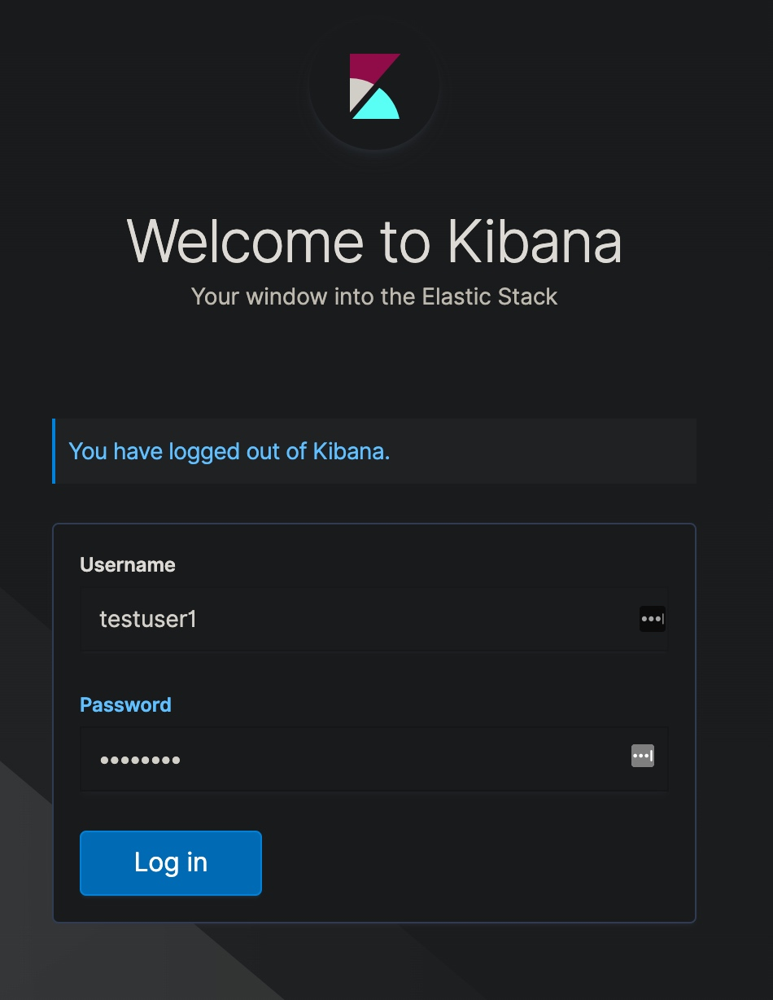
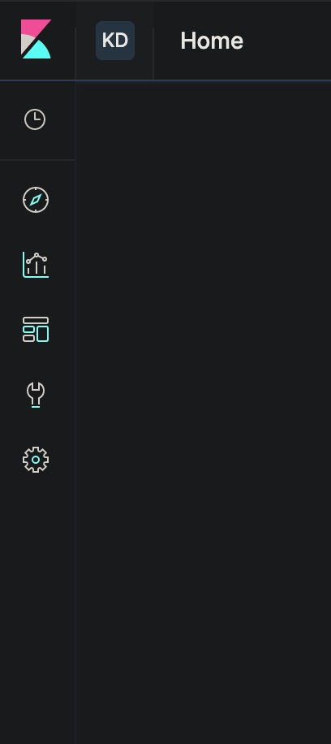

# ES/Kibana/LDAP Integration test
This repo has tools to Sandbox LDAP Groups integration for Access Control in conjunction with EK.<br>
The environment consists of a single Elasticsearch and Kibana nodes, as well as pre populated LDAP server.

## How to Test?

### Securing ES cluster and Setting up ES Trial
1. After clonning the repo and going into the path were it was cloned, let's start the containers by running<br> ``` docker-compose up -d ```
2. On a different Terminal window, execute: ```docker logs -f docker_kibana_1``` to inspect the logs for Kibana's container.
3. Once "Unauthorized error" appears on a 3rd Terminal window, run:<br> ```docker exec -it elasticsearch-docker_elasticsearch_1 bin/elasticsearch-setup-passwords auto``` <br>This command will allow Elasticsearch to randomly generate secured passwords for several services users.
4. After Saving the passwords somewhere, look for **Kibana** password and replace it in **kibana.yml / elasticsearch.password** file
5. Once it has been replaced and the changes saved, run ```docker-compose restart``` to allow Kibana to authenticate correctly against ES.
6. After that is done, we need to start a Trial for the ES node since LDAP integration is only possible for platinum license. To do that, we first ensure our setup can start a Trial by running:<br> ```docker exec -it elasticsearch-docker_elasticsearch_1 curl -X GET -u elastic:<PASTE ES PASSWORD OBTAINED FROM ABOVE HERE> "localhost:9200/_license/trial_status?pretty"``` <br>
If the result is "true", then we run<br> ```docker exec -it elasticsearch-docker_elasticsearch_1 curl -X POST -u elastic:<PASTE ES PASSWORD OBTAINED FROM ABOVE HERE> "localhost:9200/_license/start_trial?acknowledge=true&pretty"```
7. We now need to Add Roles and Roles Mappings per below instructions.

### Creating ES  Roles:
#### Creating a Default Role:
We Are setting up the type of permissions the default role will grant. In this case no permissions are given.

		docker exec -it elasticsearch-docker_elasticsearch_1 curl -X POST "localhost:9200/_security/role/kibana_default?pretty" -u elastic:<PASTE ES PASSWORD OBTAINED FROM ABOVE HERE> -H 'Content-Type: application/json' -d'
		{
		  "cluster": [],
		  "indices": [],
		  "applications": []
		}'

#### Mapping Default Role to LDAP Group: 
This is necessary to allow LDAP users belonging to specified group in this case **mygroupusers**, authenticate and be able to access Kibana and ES in accordance with privileges specified on the role.

		docker exec -it elasticsearch-docker_elasticsearch_1 curl -X PUT -u elastic:<PASTE ES PASSWORD OBTAINED FROM ABOVE HERE> "localhost:9200/_xpack/security/role_mapping/kibana_default" -H 'Content-Type: application/json' -d'
		{
		  "roles" : [ "kibana_default" ],
		  "rules" : { "field" : { "groups": "cn=mygroupusers,ou=MIM Managed Groups,dc=local,dc=com" } },
		  "enabled": true
		}'

### Creating Kibana Spaces and adding them to the Default role
#### Add Kibana Default Space:
We are creating a Kibana Space which is disabling almost all features.

		docker exec -it elasticsearch-docker_kibana_1 curl -X POST "localhost:5601/api/spaces/space" -u elastic:<PASTE ES PASSWORD OBTAINED FROM ABOVE HERE> -H 'kbn-xsrf: true' -H 'Content-Type: application/json' -d'
		{
		  "id": "kdefault",
		  "name": "Kibana Default",
		  "description" : "This is the Kibana Default Space",
		  "color": "#aabbcc",
		  "initials": "KD",
		  "disabledFeatures": ["advancedSettings","indexPatterns","savedObjectsManagement","graph","monitoring","ml","apm","maps","canvas","infrastructure","logs","siem","uptime","management"]
		}'

#### Mapping Kibana Space to ES Role:
With this we are allowing LDAP groups access a particular Space after loging into Kibana.

		docker exec -it elasticsearch-docker_kibana_1 curl -X PUT "localhost:5601/api/security/role/kibana_default" -u elastic:<PASTE ES PASSWORD OBTAINED FROM ABOVE HERE> -H 'kbn-xsrf: true' -H 'Content-Type: application/json' -d'
		{
		  "metadata" : {
		    "version" : 1
		  },
		  "elasticsearch": {
		    "cluster" : [ ],
		    "indices" : [ ]
		  },
		  "kibana": [
		    {
		      "base": [],
		      "feature": {
		       "discover": [
		          "all"
		        ],
		        "visualize": [
		          "all"
		        ],
		        "dashboard": [
		          "all"
		        ],
		        "dev_tools": [
		          "read"
		        ]
		      },
		      "spaces": [
		        "kdefault"
		      ]
		    }
		  ]
		}'
		
		

### Loging Into Kibana:
Once all above steps have been performed, the environment should be ready to login to http://localhost:5601 using user **testuser1** and password **12345678**<br>


Once logged in, you'll realize there's a **KD** intial at the left top corner which is the acroym for the newly created **Kibana Default** Space. It is also limited and only some features are allowed to this user.
<br>